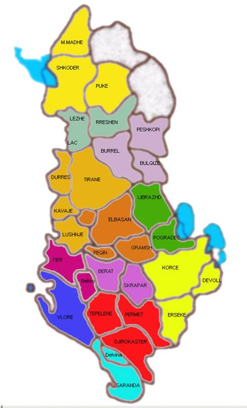

About Us
========

Why M&D
-------

Our company, has for several years been among the top 10 companies in Albania as measured by turnover, importing and distributing market leading brands to customers who vary from supermarkets, groceries, variety stores and wholesalers, to pharmacies, offices, hotels, cafes and restaurants.

Our customer base exceeds 4200 customers and we deal with more than 450 invoices every day, covering 100% of the Albanian territory and population as well as Kosovo. The customer base is divided into segments, based on both customer and commercial criteria, to allow us to put the consumer at the heart of what we do and at the same time maximise the rate of return on the investments made into outlets.

We invest 60% of our yearly profit back into our business, to enable us to continuously expand by building new distribution centres, increasing the capacity of the existing warehouses, as well as refreshing & expanding our vehicle fleet.

M&D overheads account for only 1.6% of our turnover, as a result of careful and well planned sharing of the supporting structures and people throughout our principals.	Through increased product rotation, reduced overheads and better stock management we have been able to continuously improve our net profits.

Vision and Goals
----------------
We aim to achieve and sustain absolute market leadership in our entire products portfolio.

We are fully committed to doing an excellent job in satisfying both our principals' and our target customers' needs, so that they are rewarded for the trust and confidence they have placed in us.

Our Consumer goal is to build the image of our brands in the consumers' minds:

1. The right brand
2. In the right outlets
3. With the right marketing activity