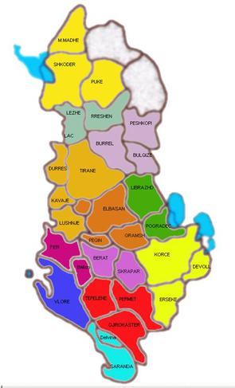

Rreth Nesh
==========

Pse M&amp;D
-----------

Prej shumë vitesh, shoqëria jonë rradhitet ndër 10 shoqëritë më të mëdha në Shqipëri për sa i përket xhiros vjetore të realizuar nga importi dhe shpërndarja nëpër klientë të ndryshëm (si supermarkete, dyqane të vogla dhe të mesme, grosistë, farmaci, zyra, hotele, kafene dhe restorante), të produkteve nga më të njohurat në treg. 

Ne kemi mbi 6,000 klientë dhe prodhojmë mbi 550 fatura cdo ditë, duke mbuluar 100% të territorit dhe të popullsisë së Shqipërisë. Klientët janë të ndarë në segmente në bazë të kërkesave që kanë, duke vënë klientin në qëndër të asaj që bëjmë, dhe njëkohësisht na lejon të rrisim shkallën e kthimit të investimeve të bëra.

Vizioni dhe Qëllimet Tona
-------------------------
Qëllimi ynë është arritja dhe mbajtja e te qënit të parët në treg, për të gjithë produktet e portofolit tonë.

Ne jemi të angazhuar plotësisht për të bërë një punë të shkëlqyer në përmbushjen e kërkesave të furnitorëve si dhe klientëve tanë, në mënyrë që ata të shpërblehen për besimin që na kanë dhënë.

Synimi ynë është krijimi dhe ngulitja e imazhit të produkteve tona në mendjet e konsumatorëve:

1. Produkti i duhur
2. Në vendin e duhur
3. Me çmimin e duhur
4. Me marketingun e duhur

