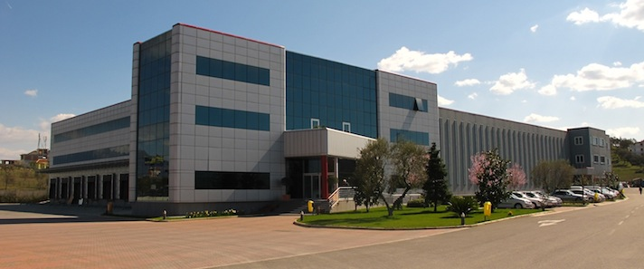

Marketing & Distribution Albania
================================

Themeluar në vitin 1991, Marketing & Shpërndarjes (M & D) është një
organizatë e orientuar drejt klientit të përfshirë në, shpërndarjen
importin dhe tregtimin e një shumëllojshmëri të gjerë të produkteve,
duke përfshirë:

* Health, Home & Beauty
* Food & Drinks
* Alcohol & Cigarettes
* Office & Stationary
* Mobile Communications

Mission Statement
-----------------
To our Principals we provide:
* Real time marketing intelligence and information
* Dedicated brand managers with the sole focus of growing their market share and business

To our customer we provide:
* Top quality merchandising of products depending on their needs
* Advertising & promotions aimed at supporting the brands and in accordance with the brand policy

Finally, to our end consumer we provide:
* Attractive and strategically organised displays of high quality competitively priced products
* Appealing promotions

