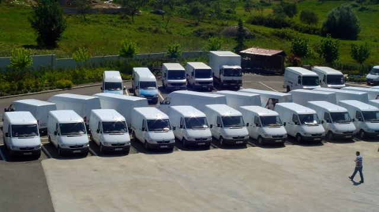

Services
=====

M&D currently has 278 employees of which 135 are directly involved in the sales process (on the field). Our brand management system is key to our success in working with a wide spread of brands across different fields. Each key brand is assigned to a specific manager who is responsible for every aspect from merchandising to marketing.

<b>Marketing</b>

Our marketing team includes:

<ul>
<li>4 marketing seniors who create and coordinate the marketing plans and activities</li>
<li>2 marketing executive who execute the projects</li>
<li>an experienced promo team (around 45 people) equipped with training staff, supervisors, promo team leaders and promo girls, all working as part of our permanent team</li>
</ul>

We have an in-house Promotion Agency that handles various tasks from in store promotions, to sponsoring events and sampling.

<b>Sales</b>

The main objectives of our sales team are:
<ol>
<li>Distribution</li>
<li>Pricing</li>
<li>Shelving</li>
<li>Merchandising</li>
</ol>
	
Our sales force includes:
<ul>
<li>Merchandisers and key account representatives covering top 120+ customers, who are constantly in touch with them, organise shelves and advise on orders</li>
<li>Van Sale Representatives who have stock availability in the van and take and deliver the order to smaller customers</li>
<li>Pre-Sale Representatives who take orders from larger customers and have access to all assortments</li>
<li>Delivery staff who handle orders that come via PSRs or placed in person, via phone or email</li>
</ul>

<b>Logistics</b>

Once an order arrives at the Albanian border, it is processed by our logistic department who handle yearly volumes of over 35.000 pallets. The Supply Chain Management team is in place to better manage stock by:
<ul>
<li>Frequent stock rotation of 10.6 times per year</li>
<li>Reducing stock levels to a calculated optimum</li>
<li>Avoiding out of stock situations in spite of the large number of SKUs and suppliers</li>
<li>Keeping stock levels at 1.5 times the sales volume in the lead time</li>
</ul>

They also handle custom clearance, and excise processing for excise goods.

<b>Distribution</b>

Our expanding fleet is what allows us to guarantee prompt delivery of goods to any part of Albania. It currently includes:

<ul>
<li>27 Caddy Vans used by our Pre-Sale Representatives</li>
<li>8 Heavy Trucks for Delivery (GVW of 10+ tons)</li>
<li>9 Light Delivery Vans</li>
<li>70 Light Vans used by our Van Sale Representatives</li>
<li>46 cars used by our Supervisors, Key Accounts Representatives, Business Unit Managers, Marketing &amp; Promotion, Merchandisers and Office Staff</li>
</ul>

<b>Others</b>

We have a very experienced finance and accounting department with dedicated people for keeping track of changes to accounting practices and rules affecting our business, and instructing the sales force about changes in procedures and regulation. Our specialised legal department handles minor cases and rulings, and we work closely with leading law firm H&amp;H in high profile cases.

