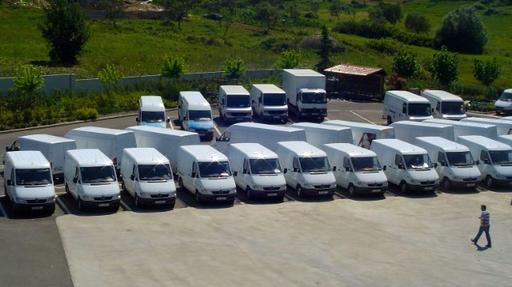

Shërbimet
=========

M&D aktualisht ka mbi 300 të punësuar nga të cilët 50% janë drejtpërdrejt të përfshirë në procesin
e shitjes (në terren). Sistemi ynë i menaxhimit është çelësi i suksesit të punës 
sonë me një grup të gjërë produktesh në fusha nga më të ndryshmet. Çdo furnitori të rëndësishëm i është
paracaktuar një menaxher i veçantë, i cili është përgjegjës për çdo aspekt.

Marketingu
----------
Ekipi ynë i marketingut përfshin:

* Menaxher marketingu që krijojnë dhe koordinojnë planet e marketingut dhe aktivitetet
* Drejtues marketingu të cilët ekzekutojnë këto projekte
* Një ekip me përvojë në promocione që përfshin trajnues, supervizor, vajza dhe mbikëqyrës promocioni, që punojnë së bashku si anëtarë të përhershëm të stafit tonë

Ne gjithashtu kemi një agjenci të brëndshme promovimi që merret me detyra të ndryshme duke nisur nga promovimet nëpër dyqane, deri në sponsorizimin e evenimeteve dhe shpërndarjen e mostrave.

Fuqia Shitëse
-------------
Objektivat kryesore të ekipit tonë të shitjes janë:

* Shpërndarja e mallrave
* Vendosja e çmimeve
* Rregullimi i rafteve
* Reklamim dhe shitje
	

Fuqia jonë shitëse përfshin:

* Persona të dedikuar që janë vazhdimisht në kontakt me 120 klientët tanë më të mëdhenj, rregullojnë raftet dhe u japin këshilla për porositë
* Menaxherë per klientët kryesorë (KAM) që janë përgjegjës për marrjen e porosive dhe marrëdhëniet me klientët tanë më te fuqishëm
* Shitës PSR të cilët marrin porositë nga grupi i klientëve mesatar dhe kanë në dispozicion të gjithë llojshmërinë e produkteve në magazinë
* Shitës VSR të cilët kanë një sasi gjendjeje në furgonin e tyre, me të cilën plotësojnë në çast porositë e klientëve të vegjël
* Shofera të cilët merren me porositë që vijnë nëpërmjet PSR-ve ose drejtpërdrejt nga klientë të tjerë, nëpërmjet telefonit ose emailit

Logjistika
-----------
Kur një porosi arrin në kufirin Shqiptar, përpunohet nga departamenti ynë i logjistikës,
të cilët merren me volume vjetore prej më shumë se 84,000 paleta.

Ekipi i logjistikës mundëson menaxhimin sa më të mirë të stokut duke:

* Rotacion i shpeshtë i stokut, mbi 10 herë në vit
* Reduktimi i gjendjes se mallrave në një nivel optimal
* Shmangia e mungese te mallrave megjithë numrin e madh të SKU-ve dhe furnitorëve
* Mbajtja e një sasie stoku në vlerën 150% të shitjeve të bëra gjatë kohës së lëvrimit

Ata gjithashtu merrem me doganën dhe akçizën për mallra të vecanta.

Shperndarja
------------
Flota jonë e automjeteve është gjithnjë në rritje, dhe na lejon të sigurojmë shpërndarjen e shpejtë të mallrave në çdo pjesë të Shqipërisë. Ajo aktualisht përfshin:

* 27 makina Caddy që përdoren nga shitësit tanë PSR
* 8 kamionë të rëndë për shpërndarje (me peshe bruto mbi 10 ton)
* 9 furgona te lehte shpërndarje 
* 70 furgona qe përdoren nga shitësit tanë VSR
* 46 automjete që përdoren nga mbikëqyrësit, supervizorët, menaxherët, ekipi i provimeve, dhe stafi i zyrës

Te tjera
--------
Departamenti ynë i specializuar i informatikës, krijon dhe mirëmban programe të brëndshme
që na lejojnë të ndjekim dhe të auditojmë biznesin tonë në çdo fazë të zinxhirit shitës. 
Statistika dhe raport të ndryshme mund të krijohen në çast, dhe ne jemi vazhdimisht duke 
punuar për të përmirësuar në këtë fushë.

Ne kemi gjithashtu një departament finance dhe kontabiliteti me shumë përvojë në këtë fushë, 
me njerëz të përkushtuar për ndjekjen e ndryshimeve në praktikat e kontabilitetit, procedurave 
dhe rregulloreve që ndikojnë në biznesin tonë, dhe që udhëzojnë forcën shitëse në lidhje me 
këto ndryshime. 

Departamenti ynë juridik merret me zgjidhjen e çështjeve të vogla ligjore, ndërkohë që Studio
Ligjore e mirënjohur H&amp;H trajton rastet e një rëndesie më të madhe.

Departamenti ynë ligjor merret me zgjidhjen e çështjeve të vogla gjyqësore, 
ndërkohë që firma e njohur H&amp;H merret me rastet me profil të lartë.

