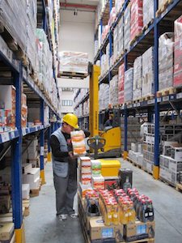

Shërbimet
=========

M&amp;D aktualisht ka mbi 300 të punësuar nga të cilët rreth 50% janë drejtpërdrejt të përfshirë në procesin
e shitjes (në terren). Sistemi ynë i menaxhimit është çelësi i suksesit të punës 
sonë me një grup të gjërë produktesh në fusha nga më të ndryshmet. Çdo furnitori të rëndësishëm i është
paracaktuar një menaxher i veçantë, i cili është përgjegjës për çdo aspekt.

Fuqia Shitëse
-------------
Objektivat kryesore të ekipit tonë të shitjes janë:

* Shpërndarja e mallrave
* Vendosja e çmimeve
* Rregullimi i rafteve
* Reklamimi dhe shitja
	

Fuqia jonë shitëse përfshin:

* Persona të dedikuar që janë vazhdimisht në kontakt me 120 klientët tanë më të mëdhenj, rregullojnë raftet dhe u japin këshilla për porositë
* Menaxhera per klientët kryesorë (KAM) që janë përgjegjës për marrjen e porosive dhe marrëdhëniet me klientët tanë më te fuqishëm
* Shitësa PSR të cilët marrin porositë nga klientët, ja dërgojnë departamentit të logjistikës, i cili realizon porosinë brënda 24 orëve
* Shitësa VSR të cilët i kanë produktet në mjetin e tyre, dhe kryejnë në çast shitjen tek klientët sipas kërkesës së tyre
* Transportuesa të cilët merren me porositë që vijnë nëpërmjet PSR-ve ose drejtpërdrejt nga klientë të tjerë, nëpërmjet telefonit ose emailit

Logjistika
-----------
Departamenti ynë i logjistikës mbulon shërbimet doganore dhe tatimore si: tranzitim, çdoganim, 
eksport per mallra dhe akçizë.

Kur një furnizim arrin në magazinat tona, përpunohet nga ky departament, i cili menaxhon një 
volum vjetor prej më shumë se 84,000 paleta. Kur një porosi arrin ne qëndrën tonë të logjistikës, 
nga klienta ose shitësa PSR, ekipi mundëson ekzekutimin e saj brënda një afati prej 24 orësh. 
 
Ekipi i logjistikës gjithashtu mundëson menaxhimin sa më të mirë të stokut përmes:

* Rotacionit të shpeshtë të stokut, mbi 10 herë në vit
* Reduktimit të gjendjes së stokut në një nivel optimal, të llogaritur në bazë të sasisë së shitur gjatë kohës së lëvrimit
* Shmangien e situatave pa gjendje malli në magazinë, megjithë numrin e madh të SKU-ve dhe furnitorëve
* Hyrjes dhe daljes së mallit në bazë të afatit të skadimit
* Lëvizjes me mjete të motorizuara (piruna dhe transpaleta elektrike) të të gjithë mallrave brënda territorit të magazinës
* Ndarjes së sipërfaqes së magazinës në koordinata që gjithashtu lehtëson punën e ekipit të magazinës

Shpërndarja
------------
Flota jonë e automjeteve, e cila është gjithnjë në rritje, na lejon të sigurojmë shpërndarjen e shpejtë të mallrave në çdo pjesë të Shqipërisë. Ajo aktualisht përfshin:

* 7 kamionë për shpërndarje me peshëmbajtje të rëndë (mbi 10 ton)
* 36 automjete transporti të përzier me peshëmbajtje të mesme (2-3 ton) që përdoren nga shitësat VSR dhe transportuesit
* 59 automjete transporti të përzier me peshëmbajtje të lehtë (0.5-2 ton) që përdoren nga shitësat VSR
* 27 automjete me peshëmbajtje deri 0.5 ton që përdoren nga shitësat PSR
* 68 automjete që përdoren nga mbikëqyrësit, supervizorët, menaxherët, ekipi i promovimeve, dhe transportimin e personelit

Marketingu
----------
Ekipi ynë i marketingut përfshin:

* Menaxher marketingu që krijojnë dhe koordinojnë planet e marketingut dhe aktivitetet
* Drejtues marketingu të cilët ekzekutojnë këto projekte
* Ekip me përvojë në promocione që përfshin trajnues, supervizor, hostes dhe mbikëqyrës promocioni, që punojnë së bashku si anëtarë të përhershëm të stafit tonë

Ne gjithashtu kemi një agjenci të brëndshme promovimi që merret me detyra të ndryshme duke nisur nga promovimet nëpër dyqane, deri në sponsorizimin e aktiviteteve dhe shpërndarjen e mostrave.

Të Tjera
--------
Departamenti ynë i specializuar i informatikës, krijon dhe mirëmban programet tona,
që na lejojnë të ndjekim dhe të auditojmë biznesin tonë në çdo fazë të zinxhirit shitës. 
Statistika dhe raporte të ndryshme mund të krijohen në çast, dhe ne punojmë vazhdimisht 
për t'u përmirësuar në këtë fushë.

Ne kemi gjithashtu një departament finance dhe kontabiliteti me shumë përvojë në këtë fushë, 
me njerëz të përkushtuar për ndjekjen e ndryshimeve në praktikat e kontabilitetit, proçedurave 
dhe rregulloreve që ndikojnë në biznesin tonë, dhe që udhëzojnë forcën shitëse në lidhje me 
këto ndryshime. 

Departamenti ynë juridik merret me zgjidhjen e çështjeve të vogla ligjore, ndërkohë që ne bashkëpunojmë
me një Studio Ligjore që trajton raste më të rëndësishme.
